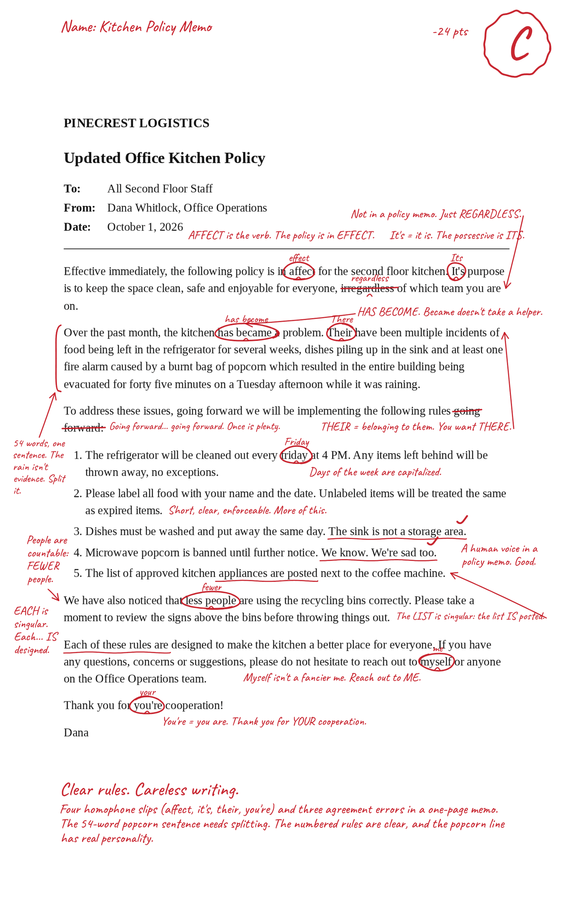
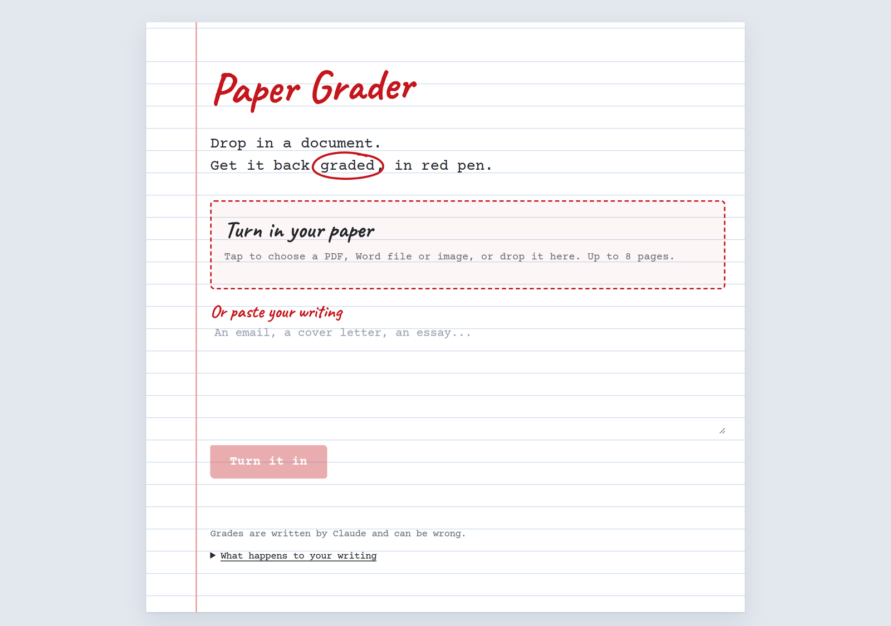
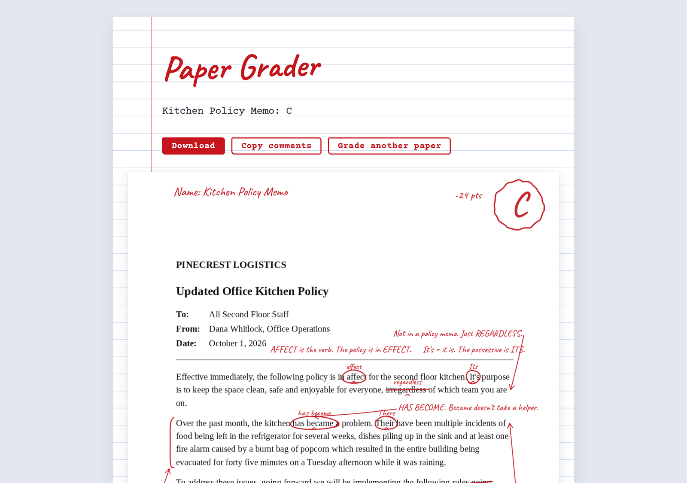
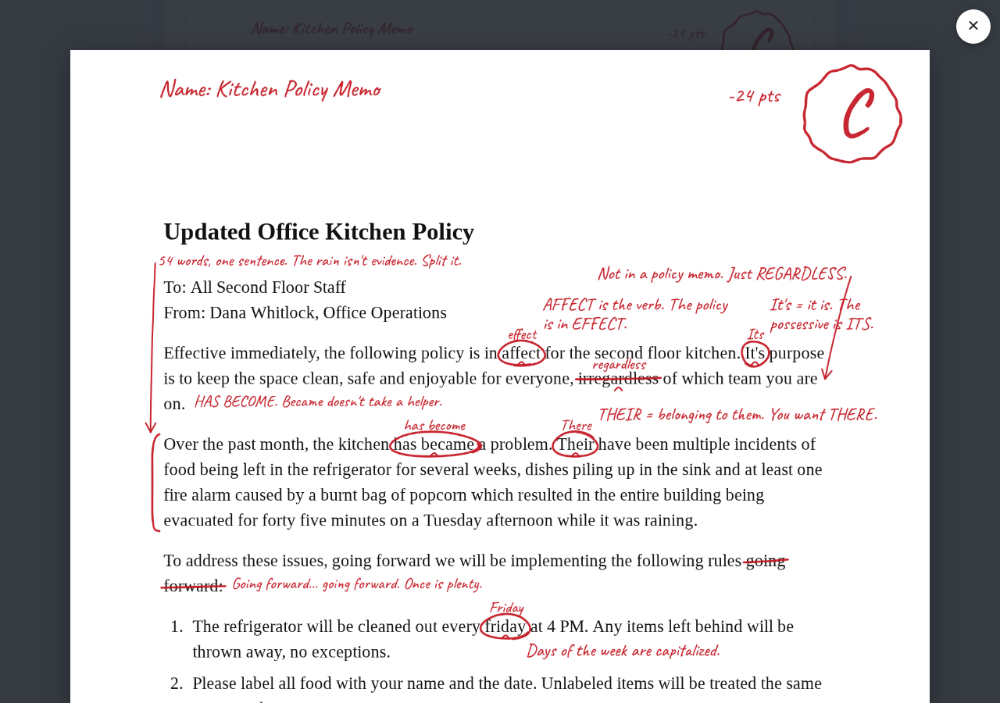
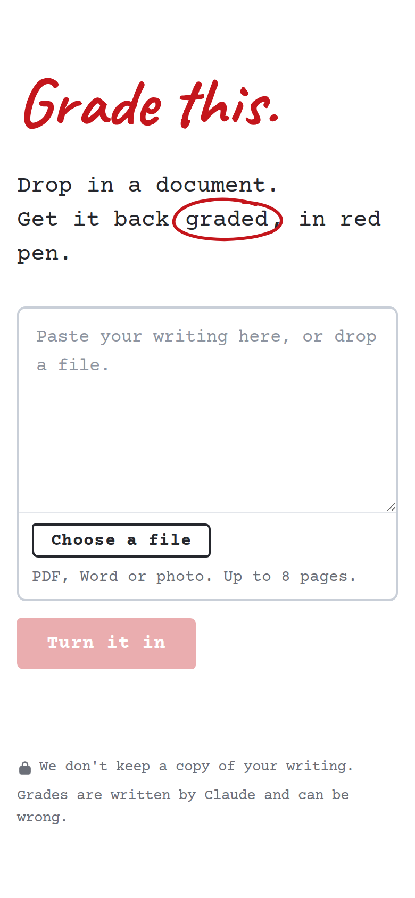
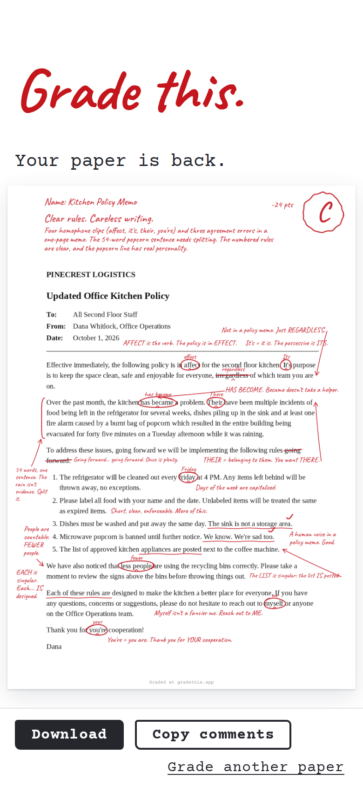

# Grade this.

[gradethis.app](https://gradethis.app)

**Drop in a document. Get it back graded, in red pen.**

Grade this. hands your writing back the way a sharp teacher would: the actual page, covered in hand-drawn red ink. Words are circled, phrases struck through, corrections written above the line and short comments squeezed into the margins. The letter grade and the teacher's overall comment sit together at the top of the first page.

<p align="center">
  
</p>

*A one-page office memo (a made-up example), graded C: four homophone slips, three agreement errors and a 54-word run-on sentence. It also gets credit for two good lines.*

---

## What it does

1. **You turn in your writing.** Upload a PDF, a Word file, a photo or screenshot of a page, or just paste text. Up to 8 pages.
2. **It reads it like a teacher.** Claude reads the text, works out what kind of writing it is (essay, work email or memo, resume) and grades it by that standard: grammar and spelling, clarity, structure and logic.
3. **You get the paper back, marked up.** The marks are drawn onto the page itself, with comments written into the page's own white space.
4. **You take it with you.** Download it (an image for one page, a PDF for several), or copy all the comments as text to fix your draft.

<p align="center">
  
  &nbsp;
  
</p>

Tap any page to read every page full size, scroll through them, then tap outside to close.

<p align="center">
  
</p>

It's built for phones as much as laptops:

<p align="center">
  
  &nbsp;
  
</p>

---

## What makes it different

- **The output is the paper itself, not a report.** Grammar tools give you a sidebar of suggestions, and AI essay graders give you a score and paragraphs of feedback. Grade this. gives back the document you turned in, marked up by hand. You see every problem where it happens, in a form anyone recognizes at a glance.
- **It feels handwritten.** Wobbly circles that overshoot, arrows with a little sag, a handwriting font, notes tucked into gaps between paragraphs and down the margins, exactly where a teacher would squeeze them. No wide comment gutter and no digital-looking boxes.
- **It's honest.** The grader is told to mark only problems it can point to in the text. A good paper gets an A with a few real nitpicks, not a list of invented errors. It also gives credit with check marks when something is done well. If a comment can't be matched to the exact words on the page, it's left off rather than placed on a guess.
- **It knows what it's reading.** A resume isn't graded like an essay (resume fragments aren't errors), and a work memo is judged on brevity and getting to the point.
- **Its voice has personality.** Direct, fair and a little dry: *"Myself isn't a fancier me. Reach out to ME."* It's never cruel.
- **It's shareable by design.** Share sends every graded page as an image, page 1 first: the grade, the verdict and the comment sit together at its top. Every page carries a small credit line so screenshots say where they came from.
- **It's private by default.** Files are opened in your browser. Only the text is sent to Claude for grading, and nothing is stored.
- **It's simple.** One screen to turn something in, one screen with the result, and no settings.

---

## Who it's for

- **People about to send something that matters:** a cover letter, a resume, an important email, a college essay, a blog post.
- **Anyone curious how a famous or official document would fare** in front of a strict English teacher. It's a fun format to share.
- **Students** who want a quick, honest second read before they turn something in.

---

## How it works

```
your file or text
   │  read in the browser: PDF.js (exact word positions), Tesseract.js OCR for photos,
   │  mammoth.js for Word; pasted text and Word files are typeset onto clean pages
   ▼
page text ──► /api/grade ──► Claude (Sonnet 5.5, structured JSON)
   │             returns: grade, overall comment, and per-comment anchor text,
   │             mark type (circle, strike, underline, squiggle, bracket, check),
   │             correction and note
   ▼
ink.js draws the marks on the page, finds the nearest free white space for each
note, routes arrows around the text, and drops minor notes rather than shrinking them
```

- **Front end:** static HTML, CSS and JavaScript, with no framework and no build step.
- **Back end:** three Vercel functions. `/api/auth` checks the passcode, `/api/grade` calls Claude, and `/api/event` counts shares and downloads.
- **Cost:** an estimated ~2¢ for a one-page paper. Each grade logs a `grade-cost` line (tokens and US$, never document text), and the Anthropic Console has the running total.

### Deploy (Vercel)

1. Import this repo as a Vercel project. Framework: Other. No build command.
2. Set the environment variables:
   - `APP_PASSCODE`: the passcode people type to use the app
   - `ANTHROPIC_API_KEY`: an Anthropic API key, ideally scoped to its own workspace with a monthly spend limit
   - optional `ANTHROPIC_WORKSPACE_ID`: only if your key isn't scoped to a workspace
   - optional `GRADER_MODEL` (default `claude-sonnet-5-5`)
3. Deploy. Every push to `main` redeploys.

`samples/` has a made-up memo (PDF and Word) for trying it out. `TODO.md` tracks what's next.
